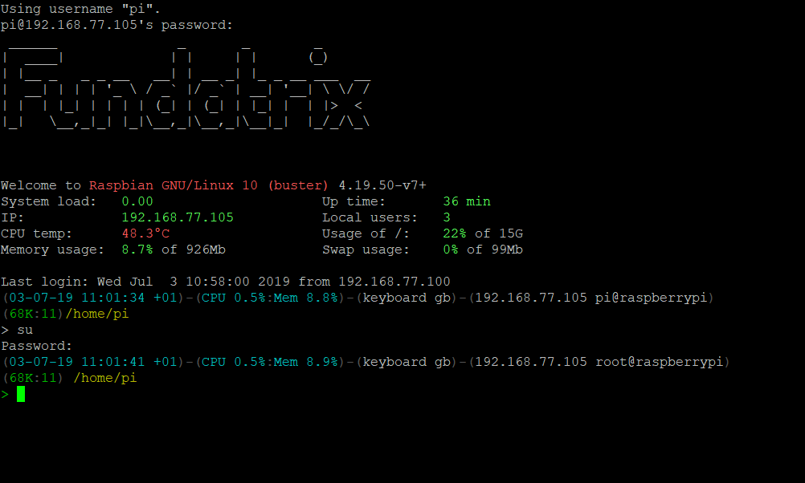

## ttb-rc

set the login message, `.bashrc`, `.nanorc` and `.vimrc` for thethingbox

### Install

``` sh
curl https://raw.githubusercontent.com/thethingbox/ttb-rc/master/install.sh | sh
```

### Results

#### login message and prompt command



### Sources

 - [bashrc](https://gist.github.com/zachbrowne/8bc414c9f30192067831fafebd14255c)
 - [nanorc](https://github.com/scopatz/nanorc)
 - [vimrc](https://github.com/amix/vimrc)
